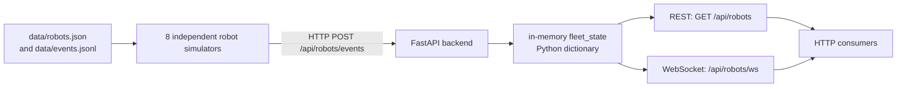
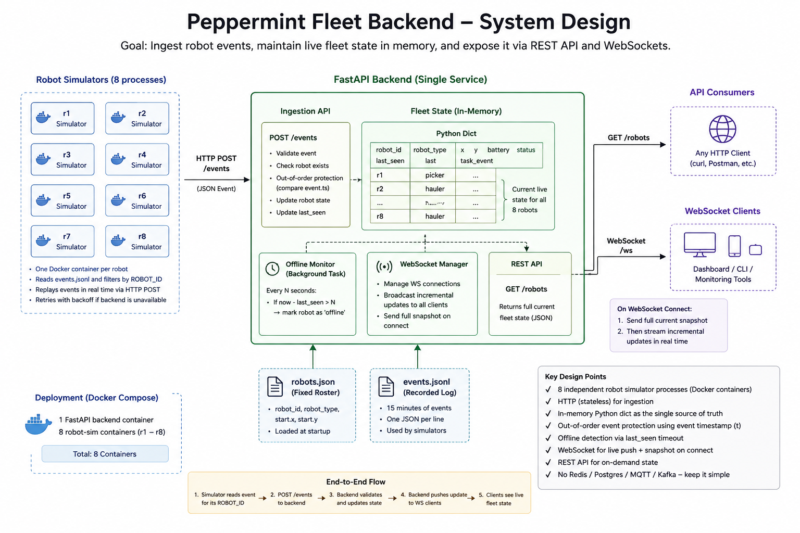
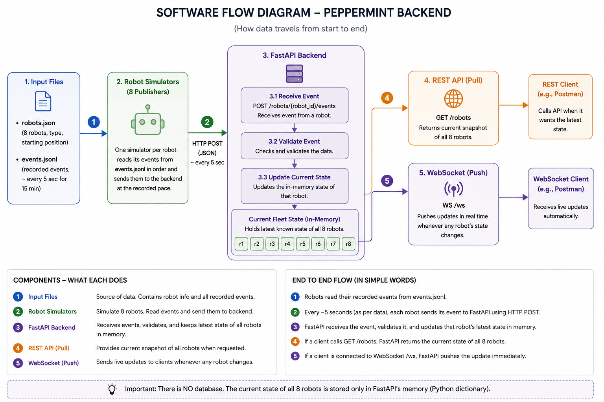

# Peppermint Fleet Backend

Assignment 2 (Backend) for the Peppermint Robotics SDE-1 hiring challenge. This project simulates an eight-robot fleet, ingests each robot's events, maintains the latest fleet state in memory, and exposes that state through REST and WebSocket interfaces.

## Overview

The backend receives position, battery, status, and event-time updates from mock robots. It keeps one current-state record per robot, rejects events that are older than the last accepted event for that robot, and makes the shared state available to polling and real-time consumers. The project is intentionally local and self-contained: Docker Compose starts the backend and all robot simulators.

## Architecture



Robot-to-backend communication is HTTP callbacks. The WebSocket direction is backend-to-consumer: connected clients receive a state snapshot when they connect and subsequent broadcasts when the fleet state is updated.

## System Design Diagram

The following supplied diagram illustrates the intended single-service, in-memory design. The endpoint paths documented in the [API](#api) section are the implementation's source of truth.



## Software Flow Diagram



## Tech Stack

- Python 3.11
- FastAPI and Uvicorn
- Pydantic
- HTTPX
- WebSockets
- Pytest
- Docker and Docker Compose

## Project Structure

```text
.
├── backend/
│   ├── main.py                 # FastAPI routes, WebSocket manager, offline checker
│   ├── schemas.py              # RobotEvent request model
│   └── state.py                # roster loading and in-memory fleet state
├── data/
│   ├── robots.json             # fixed eight-robot roster and starting positions
│   └── events.jsonl            # recorded robot events
├── simulator/
│   └── robot_simulator.py      # event replay and HTTP retry logic
├── tests/
│   ├── test_api.py
│   └── test_state.py
├── docker-compose.yml
├── Dockerfile
├── ANSWERS.md                  # challenge design answers
├── SYSTEM_DESIGN.md            # challenge system-design notes
└── requirements.txt
```

## Running the Project

Prerequisite: Docker with Docker Compose support.

From the repository root, run:

```bash
docker compose up --build
```

This builds one image and starts nine services: the `backend` and eight independent simulators (`robot-r1` through `robot-r8`). Each simulator receives its own `ROBOT_ID`, loads that robot's recorded events, and begins replaying automatically. The backend is published at `http://localhost:8000`.

Stop the stack with `Ctrl+C`; to remove the Compose containers afterwards, run `docker compose down`.

## API

### `GET /`

Health-style confirmation that the backend is running.

```json
{"message":"Peppermint Fleet Backend is running"}
```

### `GET /api/robots`

Returns the current `fleet_state`, keyed by robot ID. Each record includes `robot_id`, `robot_type`, `x`, `y`, `battery`, `status`, `last_event_time`, and `last_received_at`.

```json
{
  "r1": {
    "robot_id": "r1",
    "robot_type": "picker",
    "x": 569.9,
    "y": 33.0,
    "battery": 84.4,
    "status": "idle",
    "last_event_time": 0,
    "last_received_at": 12345.67
  }
}
```

### `POST /api/robots/events`

Accepts a `RobotEvent` JSON body and returns `{"message":"Event received"}`. The Pydantic schema requires `t`, `robot_id`, `x`, `y`, `status`, and `battery`.

```json
{
  "t": 5,
  "robot_id": "r1",
  "x": 580.9,
  "y": 29.4,
  "status": "active",
  "battery": 83.8
}
```

### WebSocket `/api/robots/ws`

Connect to receive the complete current fleet-state dictionary immediately. The backend broadcasts that same dictionary after each received event and when the offline monitor changes a robot's status. Disconnected or failed client connections are removed from the connection manager.

## State Management

`backend/state.py` loads the roster from `data/robots.json` and initializes the module-level `fleet_state` through `initialize_fleet_state()`. The dictionary is keyed by `robot_id`; each entry starts with the roster's type and position, `battery` set to `null`, an `idle` status, and empty event/receipt timestamps.

`update_robot_state()` updates a known robot's position, battery, status, and `last_event_time`, then records `last_received_at` using `time.monotonic()`. If an event has a timestamp strictly older than the robot's accepted `last_event_time`, it is ignored. `GET /api/robots` returns this shared dictionary and the WebSocket manager sends this same dictionary, keeping both interfaces aligned within the single process.

## Robot Simulation

`simulator/robot_simulator.py` reads `data/events.jsonl`, parses one JSON event per line, and selects only events whose `robot_id` matches its `ROBOT_ID` environment variable. Each Compose simulator has a distinct value from `r1` to `r8`.

The simulator replays those selected events in file order, sleeping one second between sends. It posts each event to `BACKEND_URL` (the Compose services use `http://backend:8000/api/robots/events`) with HTTPX. `send_event_with_retry()` makes the initial attempt plus up to three retries on `httpx.HTTPError`, using 1-, 2-, and 4-second exponential backoff before the retries.

## Reliability / Failure Handling

- **HTTP retry/backoff:** simulator requests retry with bounded exponential backoff after HTTPX errors.
- **Out-of-order events:** state updates reject events whose `t` is older than the last accepted timestamp for that robot.
- **Offline detection:** a background task checks once per second. When a robot has received an event but has not been heard from for more than 10 seconds, it changes that robot's status to `offline` and broadcasts the fleet state.
- **WebSocket disconnects:** explicit disconnects and send failures remove the client from the active connection list.

These mechanisms are intentionally lightweight for the assignment; they are not durable delivery or production-grade distributed coordination.

## Testing

Install the dependencies in `requirements.txt`, then run from the repository root:

```bash
python -m pytest
```

`tests/test_api.py` checks the root endpoint, fleet-state endpoint, and event-ingestion response/state update. `tests/test_state.py` verifies that `update_robot_state()` accepts a newer event and preserves state when an older event arrives afterward.

## Design Decisions

- **HTTP callbacks instead of a broker:** HTTPX and FastAPI provide a simple, observable ingestion path for the small simulated fleet without introducing broker infrastructure.
- **In-memory current state:** a dictionary keyed by robot ID provides direct lookups and a single current snapshot, which is sufficient for this local assignment.
- **Shared REST and WebSocket state:** both routes consume `fleet_state`, preventing deliberately separate state views in the single backend process.
- **Eight independent simulators:** one Compose service per robot mirrors independently publishing robots while retaining a reproducible local setup.
- **Docker Compose:** one command starts the backend and all publishers with their required service-to-service URL and robot IDs.
- **Retry plus timestamp protection:** bounded retries address transient callback failures, while timestamps prevent late older events from replacing newer state.

For the fuller assignment responses and design tradeoffs, see [ANSWERS.md](ANSWERS.md) and [SYSTEM_DESIGN.md](SYSTEM_DESIGN.md).

## Limitations

- State and event history are not persistent; restarting the backend recreates the roster-derived initial state.
- There is no authentication or authorization.
- `fleet_state` is process-local, so it is not shared across backend instances.
- There is no message broker or queue.
- WebSocket broadcasts send the full fleet-state snapshot rather than a per-robot delta.

## What I Would Build Next

Future production improvements, not features currently implemented:

1. Persist event history and current state so data survives restarts.
2. Introduce a shared state store and fanout mechanism for horizontal backend scaling.
3. Add durable broker-based ingestion and stronger event IDs or sequence numbers for idempotency.
4. Send delta-based WebSocket updates and add subscription controls.
5. Add explicit heartbeats, authentication, authorization, and operational monitoring.

## AI Delegation Notes

AI tools were used during development for implementation guidance, debugging support, test ideas, documentation assistance, and review of design tradeoffs. The submitted implementation and its behavior were reviewed and tested by the author, who understands the architecture and its current limitations.

## Submission

This Assignment 2 submission is intended to be provided as the Git repository or source archive. `docker compose up --build` is sufficient to run the backend and its local robot simulation; no deployed frontend is part of this backend assignment.
